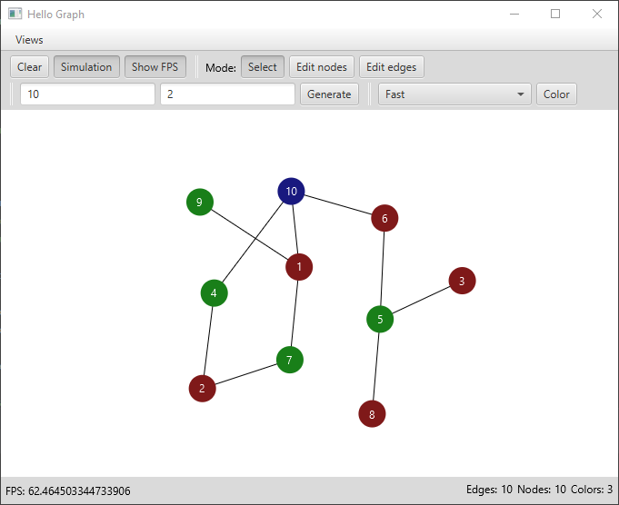

# Graph coloring program

Allows to generate random graphs or build a custom one. Meant to test different graph coloring algorithms.

Features a custom force-based algorithm to automatically space out the graph nodes.

